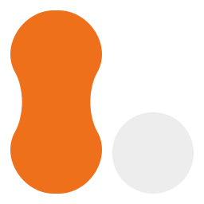
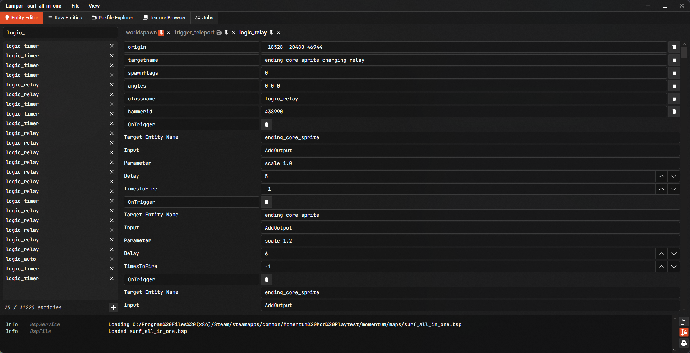
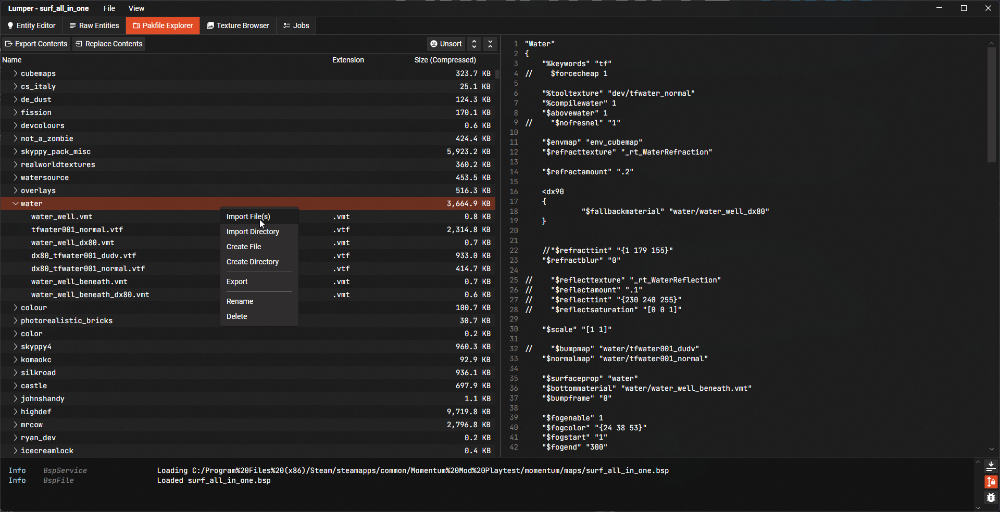
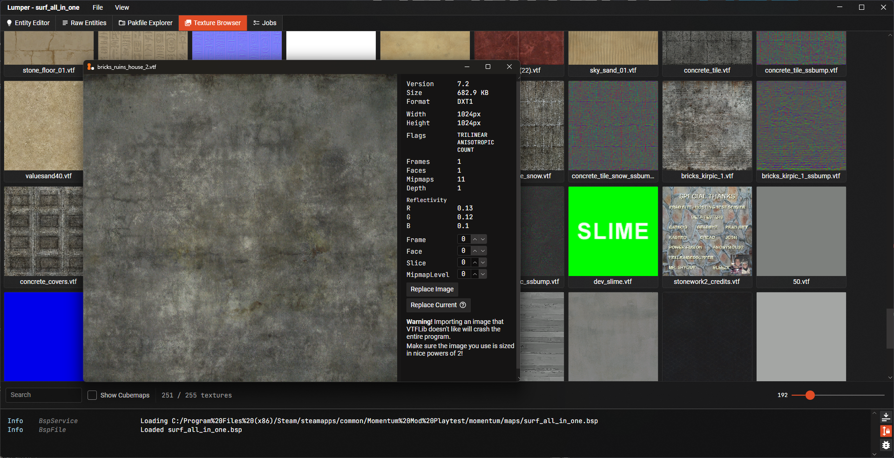
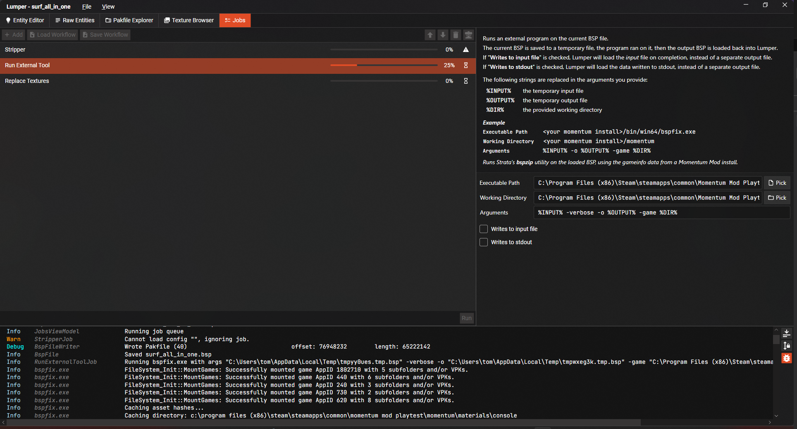

> *Momentum Mod is a standalone game built on the Source Engine, aiming to
centralize movement gametypes found in CS:S,
CS:GO, and TF2.*

<h1 style="display: flex; align-items: center; gap: 0.5rem;">
    
    Lumper
</h1>

Lumper is a program for viewing and manipulating the various "lumps" that
constitute Source Engine map files (BSPs).

It is *not* a map authoring tool like Hammer, which operates on map source
files (VMFs) that are then compiled to BSPs. Lumper is intended for small,
destructive tweaks to existing maps. It's most similar
to [VIDE](http://www.riintouge.com/VIDE/), which is unfortunately closed-source,
inactive, and doesn't support more recent BSP versions.

## Features

### Entity Editor

View and edit the contents of the entity lump à la EntSpy/VIDE. Includes a "Raw
Entities" view for editing the entire lump as plaintext.

### Pakfile Editor

View and edit the contents of the pakfile lump with a built-in file tree, text
editor, and VTF viewer.
It supports importing files/directories, exporting to the filesystem, and can
automatically update references to paths in other lumps when items are moved.

### Texture Browser

Displays every VTF file packed into the pakfile, like Hammer's texture UI.

### Jobs

Jobs are a way of automating repetitive tasks, particularly for Momentum map
porting. Multiple jobs can be ordered sequentially, and export/imported as
JSON "workflow" files. The current jobs we support are:

- __Stripper__ - Apply [Stripper:Source](https://www.bailopan.net/stripper/)
  configs to a BSP. What is usually done at
  runtime on a server via SourceMod can be *permanently* applied to the BSP
  file!
- __Replace Textures__ - Update the texdata lumps to refer to different material
  files. Supports regex!
- __Run External Tool__ - Runs a given executable on the loaded BSP.

### Compressed Exporting

Lumper can load and save LZMA compressed BSPs, including the pakfile, producing
the same result
as [`bspzip`](https://developer.valvesoftware.com/wiki/BSPZIP).

### JSON Diffs

Lumper can serialize the contents of the BSP to JSON files, helpful for
analysing a BSP in a human-readable format and
diffing BSP versions in Git.

## Download

See the [Releases](https://github.com/momentum-mod/lumper/releases) tab on the
right! This program is very new, and we
don't currently have any kind of auto-updater, so worth checking back here for
updates regularly.

## Momentum

Lumper is developed by the Momentum Mod team and contributors. We frequently
need to adjust BSPs slightly when porting for official map submission. Out of
respect for mappers we avoid modifying the original BSP as much as we possibly
can. Manipulating existing BSPs is much less intrusive than decompiling,
adjusting, then recompiling.
Lumper lets us:

- View the important parts of the BSP for moderation during map submission,
  *especially* the pakfile lump.
- Remove packed assets we shouldn't be storing/serving (usually Valve stuff,
  e.g. CS:S textures packed for use in
  CS:GO).
- Tweak entities to better use native Momentum entities, and remove unnecessary
  ones, often via Stripper configs.
- Move pesky music files to the `sound/music/` directory of the paklump so
  they're affected by the right volume sliders
  ingame.

## Technical Details

Lumper is written in C#, targeting .NET. It's divided into three subprojects:

- __Lumper.Lib__ - Library for BSP manipulation, with minimal dependencies. Also
  includes jobs. Rather than do VTF handling oureslves we
  use [VTFLib.NET](https://github.com/momentum-mod/VTFLib.NET), which provides
  .NET bindings for [VTFLib](https://github.com/NeilJed/VTFLib).
- __Lumper.UI__ - GUI frontend using [Avalonia](https://docs.avaloniaui.net/).
  It uses an MVVM architecture with XAML for layouting
  and [ReactiveUI](https://www.reactiveui.net/) for reactivity and view ↔
  viewmodel binding.
- __Lumper.CLI__ - Simple CLI application for repetitive tasks, especially jobs.
  It's WIP and as of writing, barely
  functional.

See [our wiki](https://github.com/momentum-mod/lumper/wiki/Dev-Home) for more
info!

### Contributing

We are happy to accept contributions! Whilst we prioritize Momentum-related
use-cases ourselves, we hope this tool is helpful to anyone using Source 1, and
we welcome contributions and bug reports from people not involved with Momentum.

Besides this repo the best way to contact us is on
the [Momentum Mod Discord server](https://discord.gg/momentummod), ideally in
the `#tooling` channel.
